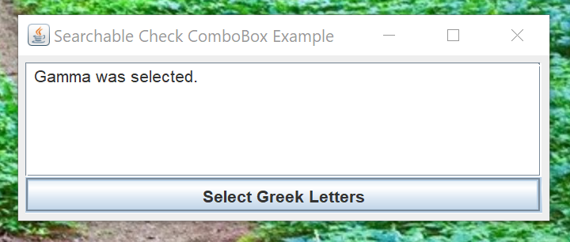

# Searchable CheckBox ComboBox

## Introduction

I encountered this [Stack Overflow question](https://stackoverflow.com/questions/77742655/how-to-make-a-searchable-checkcombobox-in-javafx-and-controlsfx) a couple of days ago. I don't use JavaFX, so I couldn't answer his question.  But the idea intrigued me.  Could I make a searchable, checkbox, combobox using Java Swing?

So, I decided to create a Java Swing searchable, checkbox, combobox component and an example application to test the component out.

Here's what I came up with.  My Alt+Print Screen function no longer works.  I had to use Windows+Print Screen and crop the image.

I created an example application that allows the user to select letters from the Greek alphabet.  The model was initiated with the Gamma letter selected.  Pressing the "Select Greek Letters" button brings up a searchable, checkbox, combobox dialog that allows you to select any Greek letters.

As you can see, the Greek letter Gamma is selected.

You can select or deselect any letters by scrolling through the list and selecting or deselecting the letters.  Since there are a few letters to choose from, the search function isn't helpful.

To use the search function, just type in the Search text box.  One letter, preferably a vowel, will shrink the display to the letters with that vowel.  To return to the full display, just erase the letters in the Search text box.

The "Select All" and "Deselect All" buttons work with the displayed letters.  The "Select All" button selects all of the displayed letters.  The "Deselect All" button deselects all of the displayed letters. 

The JAR file attached to this project is an executable JAR file.  You can download the JAR file and try out the example application to see how it works.

## Usage

To use this searchable, checkbox, combobox `JDialog`, you have to follow four steps.

1. Create a decorator class that extends the abstract `BaseItem` class.
2. Create a `java.util.List` class of decorator class instances.
3. Instanstiate the `SearchableCheckComboBoxDialog` class.
4. Test the return code to make sure the user pressed the `OK` button on the `JDialog`.
